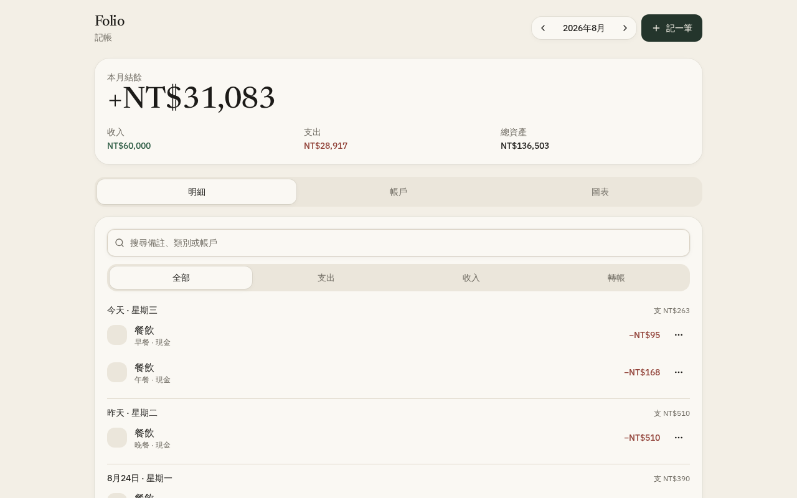

# Folio 記帳

離線優先的個人記帳工具。以「記一筆」為核心，按日流水帳查看支出、收入與轉帳，並即時重算帳戶餘額。

資料只存在瀏覽器本機（`localStorage`），不需註冊、不上傳伺服器。



## 主要特色

- **記一筆**：支出、收入或轉帳，選類別、帳戶、日期與備註
- **明細**：按日分組（今天／昨天會標示），可搜尋備註、類別或帳戶
- **帳戶**：現金、銀行、信用卡與自訂帳戶；信用卡可用負數表示欠款
- **圖表**：本月支出類別圓環圖與占比
- **即時結餘**：本月收入、支出、結餘與總資產會隨記帳立刻更新
- **示範帳目**：第一次開啟會帶入一個月的範例資料，可直接改或刪

## 技術

- React 19 + TypeScript
- TanStack Start / Router
- Tailwind CSS v4
- Zustand（persist）
- Recharts
- Radix UI

## 快速開始

需要 [Node.js](https://nodejs.org/) 22 以上。

```bash
git clone https://github.com/richie7p/cinder-green-yellow-cinder.git
cd cinder-green-yellow-cinder
npm install
npm run dev
```

瀏覽器開啟提示的本機網址即可使用。

### 其他指令

```bash
npm run build       # 正式建置
npm run typecheck   # TypeScript 檢查
npm run lint        # ESLint
```

## 使用方式

1. 按 **記一筆**，填金額與類別。
2. 在 **明細** 用搜尋或「全部／支出／收入／轉帳」篩選。
3. 在 **帳戶** 新增銀行或信用卡，並設定期初餘額。
4. 用 **圖表** 看這個月錢花在哪。
5. 每筆紀錄右側選單可編輯或刪除。

轉帳會從轉出帳戶扣款、轉入帳戶加款，不計入本月收入或支出。

## 資料說明

帳目與帳戶存在瀏覽器的 `localStorage` 鍵 `folio-ledger-v1`。

- 清除網站資料或換瀏覽器，紀錄會消失
- 不適合當成唯一的財務備份
- 示範帳目只在尚未初始化時寫入；刪光紀錄後不會自動再灌一次

## 專案結構

```text
src/
  components/budget/   記帳畫面、記一筆與帳戶對話框
  lib/budget/          類別、帳戶餘額計算、範例資料、Zustand store
  routes/              頁面路由
```

## License

個人專案，僅供學習與自用。
